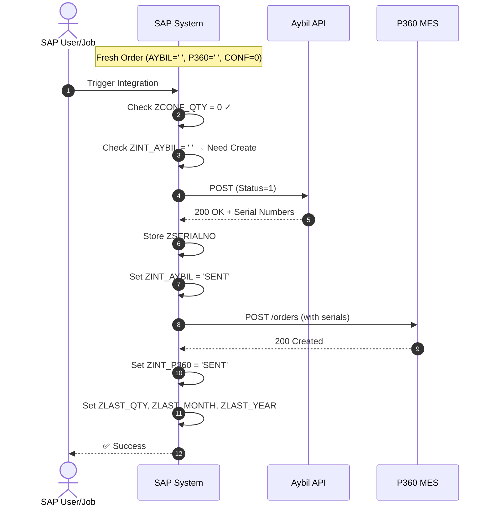
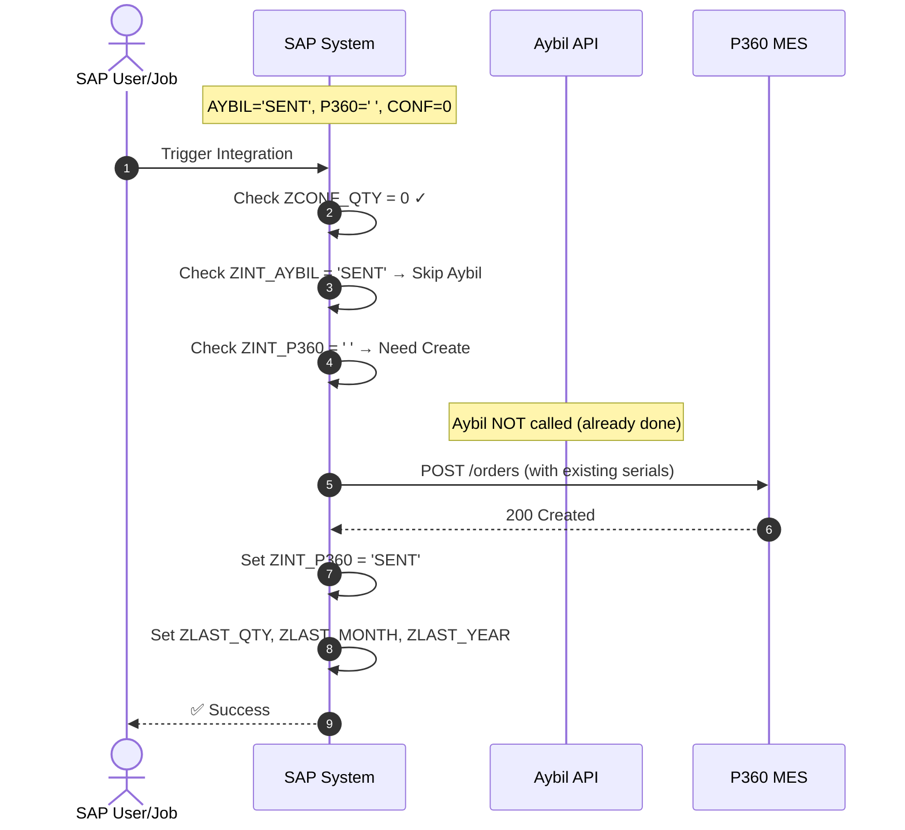
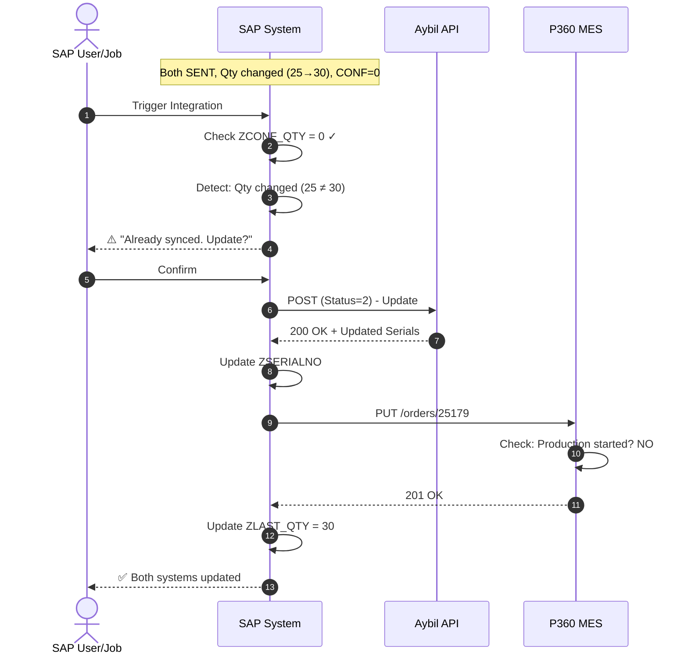
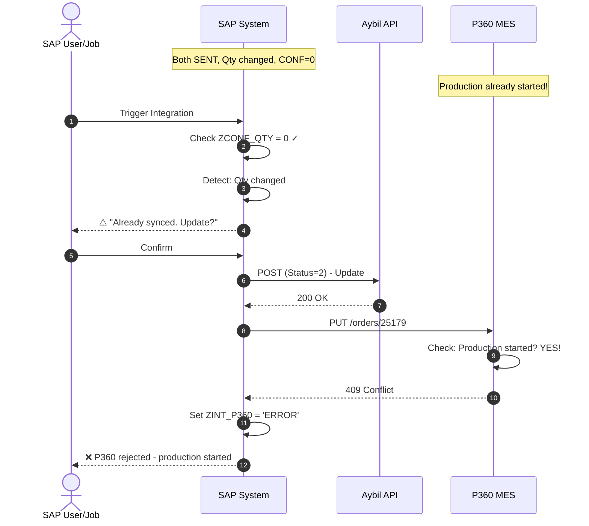
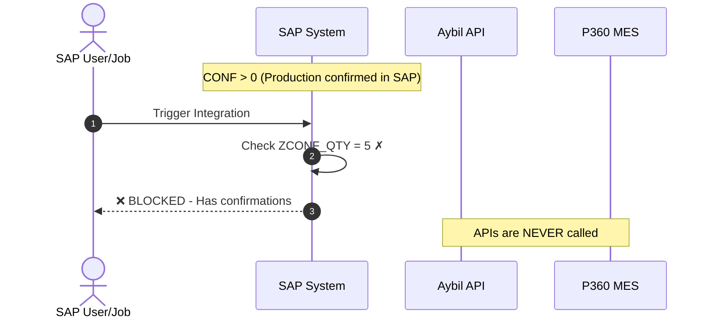

# Technical Design: SAP ↔ Aybil ↔ P360 Integration

**Interface ID:** `INT-PP-001`  
**Description:** Planned Order Synchronization with Serial Number Generation  
**Document Version:** 4.0 (Updated Feb 2026)

---

## 1. System Overview

### 1.1 System Roles

| System | Role | Severity | Key Function |
|:-------|:-----|:---------:|:-------------|
| **SAP** | Source of Truth | 🔴 High | Order management, triggers integrations |
| **Aybil** | Label Automation | 🔴 High | Generates serial numbers, prints barcodes on production line |
| **P360** | MES (Manufacturing Execution) | 🔴 High | Tracks production, manages shop floor execution |

### 1.2 Data Flow

```
┌─────────────────────────────────────────────────────────────────────────────┐
│                              INTEGRATION FLOW                                │
└─────────────────────────────────────────────────────────────────────────────┘

     ┌───────┐          ┌───────────┐          ┌───────────┐
     │  SAP  │          │   AYBIL   │          │   P360    │
     │       │   [1]    │           │   [2]    │           │
     │ Order ├─────────►│  Generate ├─────────►│   MES     │
     │ Data  │  Create  │  Serial   │  Create  │Production │
     │       │  Order   │  Numbers  │  Order   │  Tracking │
     └───────┘          └───────────┘          └───────────┘
         │                    │                      │
         │              Serial Numbers          Production
         │              (Barcodes)               Status
         │                    │                      │
         │                    ▼                      ▼
         │              ┌───────────┐          ┌───────────┐
         │              │ Labels    │          │ Started?  │
         │              │ Printed   │          │ Confirmed?│
         └──────────────┴───────────┴──────────┴───────────┘
                              │
                              ▼
                    P360 Request needs Serial
                    Numbers from Aybil Response
```

### 1.3 Golden Rules

| # | Rule | Reason |
|:-:|:-----|:-------|
| 1 | Aybil MUST be called before P360 | P360 needs serial numbers from Aybil |
| 2 | If Aybil fails, P360 is NOT called | No serial numbers = can't create P360 order |
| 3 | P360 has production state checks | Once production starts, changes are not allowed from external resources |
| 4 | SAP confirmations = production happened | If SAP has confirmations, it means production started |

### 1.4 Trigger Sources

| Source | Description | Use Case |
|:-------|:------------|:---------|
| **Cockpit Screen** | Manual user interface | User reviews list and clicks "Send" |
| **Automatic Job** | Scheduled background job | Runs periodically (e.g., every 15 min) |

Both sources use the SAME rules defined in this document.

---

## 2. Status Tracking

### 2.1 SAP Status Fields

| Field | Description | Possible Values |
|:------|:------------|:----------------|
| `ZINT_AYBIL` | Aybil sync status | `' '`, `SENT`, `ERROR` |
| `ZINT_P360` | P360 sync status | `' '`, `SENT`, `ERROR` |
| `ZCONF_QTY` | Confirmed quantity | 0, 1, 2, ... n |
| `ZSERIALNO` | Serial numbers from Aybil | Array of strings |
| `ZLAST_SYNC_DATE` | Last sync timestamp | DateTime |
| `ZLAST_QTY` | Quantity at last sync | Integer |
| `ZLAST_MONTH` | Month at last sync | Integer (1-12) |
| `ZLAST_YEAR` | Year at last sync | Integer (e.g., 2026) |

### 2.2 Status Combinations & Meanings

| ZINT_AYBIL | ZINT_P360 | ZCONF_QTY | Meaning | What to Do? |
|:----------:|:---------:|:---------:|:--------|:------------|
| `' '` | `' '` | 0 | Fresh order, never synced | ✅ Full access |
| `SENT` | `' '` | 0 | Aybil done, P360 pending | ✅ Can call P360 |
| `SENT` | `SENT` | 0 | Fully synced, not started | ⚠️ Update with warning |
| `SENT` | `SENT` | >0 | In production with confirmations | ❌ Blocked |
| `ERROR` | `' '` | 0 | Aybil failed | ✅ Retry Aybil |
| `SENT` | `ERROR` | 0 | P360 failed | ✅ Retry P360 |
| `ERROR` | `ERROR` | 0 | Both failed | ✅ Retry both |

---

## 3. Change Detection Rules

### 3.1 What Counts as a "Change"?

#### 3.1.1 Quantity Change

| Scenario | Is Change? | Action Required |
|:---------|:----------:|:----------------|
| 25 → 30 | ✅ Yes | Update both systems |
| 25 → 25 | ❌ No | No action |
| 25 → 0 | ✅ Yes | Consider as Delete |

**Rule:** `CurrentQty ≠ ZLAST_QTY`

#### 3.1.2 Date Change (IMPORTANT!)

**Only MONTH or YEAR changes are significant. Day changes are ignored.**

| Old Date | New Date | Month Changed? | Year Changed? | Is Significant? |
|:---------|:---------|:--------------:|:-------------:|:---------------:|
| 2026-01-15 | 2026-01-20 | ❌ No | ❌ No | ❌ **NO** |
| 2026-01-15 | 2026-02-15 | ✅ Yes | ❌ No | ✅ **YES** |
| 2026-01-15 | 2027-01-15 | ❌ No | ✅ Yes | ✅ **YES** |
| 2026-01-15 | 2027-03-20 | ✅ Yes | ✅ Yes | ✅ **YES** |
| 2026-12-01 | 2027-01-01 | ✅ Yes | ✅ Yes | ✅ **YES** |

**Rule:** 
```
IsSignificantDateChange = (CurrentMonth ≠ ZLAST_MONTH) OR (CurrentYear ≠ ZLAST_YEAR)
```

#### 3.1.3 Line (Asset) Change

| Priority | Action |
|:--------:|:-------|
| 🟢 Low | Update allowed, but less critical |

#### 3.1.4 Material/BOM Change

| Priority | Action |
|:--------:|:-------|
| 🔴 Critical | Must update - changes entire order |

### 3.2 Change Detection Summary

| Field | Priority | Triggers Update? | Detection Rule |
|:------|:--------:|:----------------:|:---------------|
| `quantity` | 🔴 Critical | ✅ Yes | `Qty ≠ ZLAST_QTY` |
| `plannedDate` (Month/Year) | 🔴 Critical | ✅ Yes | `Month ≠ ZLAST_MONTH OR Year ≠ ZLAST_YEAR` |
| `plannedDate` (Day only) | ⚪ Ignore | ❌ No | - |
| `materialCode` | 🔴 Critical | ✅ Yes | Any change |
| `BOM Materials` | 🔴 Critical | ✅ Yes | Any change |
| `assetName` (Line) | 🟢 Low | ⚠️ Optional | Any change |

---

## 4. Cockpit / Job Filtering Rules

### 4.1 What Shows in the Cockpit List?

The cockpit screen and automatic job should only show/process orders that **require action**.

#### 4.1.1 Cockpit List Filter Logic

```
┌─────────────────────────────────────────────────────────────────────────────┐
│                     SHOULD ORDER APPEAR IN COCKPIT LIST?                     │
└─────────────────────────────────────────────────────────────────────────────┘
                                      │
                                      ▼
                         ┌────────────────────────┐
                         │  ZCONF_QTY > 0 ?       │
                         │  (Has Confirmations?)  │
                         └────────────────────────┘
                                │           │
                               YES          NO
                                │           │
                                ▼           ▼
                         ┌─────────────┐  ┌────────────────────────┐
                         │ ❌ EXCLUDE  │  │  Never Synced?         │
                         │ from list   │  │  (AYBIL=' ' AND P360=' ')
                         │             │  └────────────────────────┘
                         │ "Production │        │           │
                         │  started"   │       YES          NO
                         └─────────────┘        │           │
                                                ▼           ▼
                                         ┌───────────┐  ┌────────────────────┐
                                         │ ✅ SHOW   │  │  Has Changes?      │
                                         │ in list   │  │  (Qty/Date/etc)    │
                                         │           │  └────────────────────┘
                                         │ "Needs    │        │           │
                                         │  initial  │       YES          NO
                                         │  sync"    │        │           │
                                         └───────────┘        ▼           ▼
                                                        ┌───────────┐  ┌───────────┐
                                                        │ ✅ SHOW   │  │ ❌ EXCLUDE│
                                                        │ in list   │  │ from list │
                                                        │           │  │           │
                                                        │ "Needs    │  │ "No action│
                                                        │  update"  │  │  needed"  │
                                                        └───────────┘  └───────────┘
```

#### 4.1.2 Cockpit List Filter Table

| Condition | Show in List? | Reason |
|:----------|:-------------:|:-------|
| Never synced (`AYBIL=' '` AND `P360=' '`) | ✅ Yes | Needs initial sync |
| Aybil sent, P360 pending | ✅ Yes | Needs P360 sync |
| Both sent, has changes | ✅ Yes | Needs update |
| Both sent, no changes | ❌ No | Nothing to do |
| Has confirmations | ❌ No | Production started, blocked |
| ERROR status (any) | ✅ Yes | Needs retry |


---

## 5. Complete Decision Matrix

### 5.1 CREATE Scenarios

| # | Aybil Status | P360 Status | SAP Confirm | Change? | Show in List? | Action | Message |
|:-:|:------------:|:-----------:|:-----------:|:-------:|:-------------:|:------:|:--------|
| C1 | `' '` | `' '` | None | N/A | ✅ Yes | ✅ Proceed | Call Aybil → P360 |
| C2 | `SENT` | `' '` | None | N/A | ✅ Yes | ✅ Proceed | Call P360 only |
| C3 | `SENT` | `SENT` | None | ❌ No | ❌ No | 🚫 Skip | Don't show - already synced |
| C4 | `SENT` | `SENT` | None | ✅ Yes | ✅ Yes | ⚠️ Warn | Has changes - treat as Update |
| C5 | `SENT` | `SENT` | Exists | Any | ❌ No | ❌ Block | Has confirmations |
| C6 | `ERROR` | `' '` | None | N/A | ✅ Yes | ✅ Retry | Retry Aybil |
| C7 | `SENT` | `ERROR` | None | N/A | ✅ Yes | ✅ Retry | Retry P360 |
| C8 | `ERROR` | `ERROR` | None | N/A | ✅ Yes | ✅ Retry | Retry both |

### 5.2 UPDATE (Quantity) Scenarios

| # | Aybil Status | P360 Status | SAP Confirm | P360 Prod State | Show in List? | Action | Message |
|:-:|:------------:|:-----------:|:-----------:|:---------------:|:-------------:|:------:|:--------|
| UQ1 | `' '` | `' '` | None | N/A | ✅ Yes | ✅ Proceed | Create flow (includes new qty) |
| UQ2 | `SENT` | `' '` | None | N/A | ✅ Yes | ✅ Proceed | Update Aybil → Create P360 |
| UQ3 | `SENT` | `SENT` | None | Not Started | ✅ Yes | ⚠️ Warn | Update Aybil → Update P360 |
| UQ4 | `SENT` | `SENT` | None | Started | ✅ Yes | ❌ Fail | P360 rejects (409) |
| UQ5 | `SENT` | `SENT` | Exists | Any | ❌ No | ❌ Block | Has confirmations - blocked |
| UQ6 | `ERROR` | `' '` | None | N/A | ✅ Yes | ✅ Retry | Retry Aybil (with new qty) |
| UQ7 | `SENT` | `ERROR` | None | N/A | ✅ Yes | ✅ Retry | Retry P360 (with new qty) |

### 5.3 UPDATE (Date - Significant Change) Scenarios

**Remember: Only Month/Year changes are significant!**

| # | Aybil Status | P360 Status | SAP Confirm | P360 Prod State | Show in List? | Action | Message |
|:-:|:------------:|:-----------:|:-----------:|:---------------:|:-------------:|:------:|:--------|
| UD1 | `' '` | `' '` | None | N/A | ✅ Yes | ✅ Proceed | Create flow (includes new date) |
| UD2 | `SENT` | `' '` | None | N/A | ✅ Yes | ✅ Proceed | Update Aybil → Create P360 |
| UD3 | `SENT` | `SENT` | None | Not Started | ✅ Yes | ⚠️ Warn | Update Aybil → Update P360 |
| UD4 | `SENT` | `SENT` | None | Started | ✅ Yes | ❌ Fail | P360 rejects (409) |
| UD5 | `SENT` | `SENT` | Exists | Any | ❌ No | ❌ Block | Has confirmations - blocked |
| UD6 | `ERROR` | `' '` | None | N/A | ✅ Yes | ✅ Retry | Retry Aybil (with new date) |
| UD7 | `SENT` | `ERROR` | None | N/A | ✅ Yes | ✅ Retry | Retry P360 (with new date) |

### 5.4 UPDATE (Date - Day Only Change) Scenarios

**Day-only changes are NOT significant - no action required!**

| # | Aybil Status | P360 Status | SAP Confirm | Show in List? | Action | Message |
|:-:|:------------:|:-----------:|:-----------:|:-------------:|:------:|:--------|
| DD1 | Any | Any | Any | ❌ No | 🚫 Skip | Day change ignored |

### 5.5 UPDATE (Line/Asset) Scenarios

| # | Aybil Status | P360 Status | SAP Confirm | P360 Prod State | Show in List? | Action | Message |
|:-:|:------------:|:-----------:|:-----------:|:---------------:|:-------------:|:------:|:--------|
| UL1 | `' '` | `' '` | None | N/A | ✅ Yes | ✅ Proceed | Include in create flow |
| UL2 | `SENT` | `' '` | None | N/A | ✅ Yes | ✅ Proceed | Update Aybil → Create P360 |
| UL3 | `SENT` | `SENT` | None | Not Started | ⚠️ Maybe | ⚠️ Warn | Low priority update |
| UL4 | `SENT` | `SENT` | None | Started | ⚠️ Maybe | ⚠️ Try | May be allowed by P360 |
| UL5 | `SENT` | `SENT` | Exists | Any | ❌ No | ❌ Block | Has confirmations - blocked |

### 5.6 DELETE Scenarios

| # | Aybil Status | P360 Status | SAP Confirm | P360 Prod State | Show in List? | Action | Message |
|:-:|:------------:|:-----------:|:-----------:|:---------------:|:-------------:|:------:|:--------|
| D1 | `' '` | `' '` | None | N/A | ✅ Yes | ✅ Proceed | Nothing external to delete |
| D2 | `SENT` | `' '` | None | N/A | ✅ Yes | ✅ Proceed | Delete from Aybil only |
| D3 | `SENT` | `SENT` | None | Not Started | ✅ Yes | ⚠️ Warn | Delete from both systems |
| D4 | `SENT` | `SENT` | None | Started | ✅ Yes | ❌ Fail | P360 rejects (409) |
| D5 | `SENT` | `SENT` | Exists | Any | ❌ No | ❌ Block | Has confirmations - blocked |

---

## 6. Visual Decision Matrix

### 6.1 Master Grid: Aybil × P360 × Confirmations

```
┌──────────────────────────────────────────────────────────────────────────────────────┐
│                           MASTER DECISION GRID                                        │
├──────────────────────────────────────────────────────────────────────────────────────┤
│                                                                                       │
│                        ZINT_P360                                                      │
│              ┌────────────┬────────────┬────────────┐                                │
│              │    ' '     │   SENT     │   ERROR    │                                │
│  ┌───────────┼────────────┼────────────┼────────────┤                                │
│  │           │            │            │            │                                │
│  │    ' '    │  ✅ CREATE │  N/A (*)   │  N/A (*)   │  ZCONF = 0                     │
│  │           │  Both      │            │            │                                │
│ Z├───────────┼────────────┼────────────┼────────────┤                                │
│ I│           │            │            │            │                                │
│ N│   SENT    │  ✅ P360   │  See Below │  ✅ RETRY  │  ZCONF = 0                     │
│ T│           │  Only      │  (Changes?)│  P360      │                                │
│ _├───────────┼────────────┼────────────┼────────────┤                                │
│ A│           │            │            │            │                                │
│ Y│   ERROR   │  ✅ RETRY  │  N/A (*)   │  ✅ RETRY  │  ZCONF = 0                     │
│ B│           │  Aybil     │            │  Both      │                                │
│ I├───────────┼────────────┼────────────┼────────────┤                                │
│ L│           │            │            │            │                                │
│  │   ANY     │  ❌ BLOCK  │  ❌ BLOCK  │  ❌ BLOCK  │  ZCONF > 0                     │
│  │           │            │            │            │                                │
│  └───────────┴────────────┴────────────┴────────────┘                                │
│                                                                                       │
│  (*) These combinations shouldn't normally occur                                      │
│                                                                                       │
└──────────────────────────────────────────────────────────────────────────────────────┘
```

### 6.2 Sub-Grid: Both SENT + No Confirmations

```
┌──────────────────────────────────────────────────────────────────────────────────────┐
│              WHEN: ZINT_AYBIL = 'SENT' AND ZINT_P360 = 'SENT' AND ZCONF = 0          │
├──────────────────────────────────────────────────────────────────────────────────────┤
│                                                                                       │
│                        HAS SIGNIFICANT CHANGES?                                       │
│              ┌───────────────────────┬───────────────────────┐                       │
│              │          NO           │          YES          │                       │
│  ┌───────────┼───────────────────────┼───────────────────────┤                       │
│  │           │                       │                       │                       │
│ P│    NOT    │  ❌ Don't show        │  ⚠️ Show + Warn       │                       │
│ 3│  STARTED  │  Nothing to do        │  "Update both?"       │                       │
│ 6│           │                       │  → Update allowed     │                       │
│ 0├───────────┼───────────────────────┼───────────────────────┤                       │
│  │           │                       │                       │                       │
│ P│  STARTED  │  ❌ Don't show        │  ⚠️ Show + Warn       │                       │
│ R│ (no conf) │  Nothing to do        │  "Update both?"       │                       │
│ O│           │                       │  → P360 will REJECT   │                       │
│ D│           │                       │  (409 error)          │                       │
│  └───────────┴───────────────────────┴───────────────────────┘                       │
│                                                                                       │
│  "Significant Changes" = Qty changed OR Month changed OR Year changed                │
│                                                                                       │
└──────────────────────────────────────────────────────────────────────────────────────┘
```

---

## 7. Blocking Logic Flowcharts

### 7.1 Complete Pre-Flight Check

```
┌─────────────────────────────────────────────────────────────────────────────┐
│                    INTEGRATION TRIGGER (BUTTON or JOB)                       │
└─────────────────────────────────────────────────────────────────────────────┘
                                      │
                                      ▼
                         ┌────────────────────────┐
                         │  1. ZCONF_QTY > 0 ?    │
                         │  (Has Confirmations?)  │
                         └────────────────────────┘
                                │           │
                               YES          NO
                                │           │
                                ▼           ▼
                         ┌─────────────┐  ┌────────────────────────┐
                         │ ❌ BLOCKED  │  │  2. Both SENT?         │
                         │ Don't show  │  │  (AYBIL & P360)        │
                         └─────────────┘  └────────────────────────┘
                                                │           │
                                               YES          NO
                                                │           │
                                                ▼           ▼
                                   ┌────────────────┐  ┌────────────────┐
                                   │ 3. Has Changes?│  │ ✅ PROCEED     │
                                   │ (Qty/Month/Yr) │  │ Normal flow    │
                                   └────────────────┘  └────────────────┘
                                      │           │
                                     YES          NO
                                      │           │
                                      ▼           ▼
                              ┌─────────────┐  ┌─────────────┐
                              │ ⚠️ WARNING  │  │ ❌ SKIP    │
                              │ "Already    │  │ Don't show  │
                              │  synced.    │  │ Nothing to  │
                              │  Update?"   │  │ do          │   
                              └─────────────┘  └─────────────┘   
                                    │
                                 User/Job Confirms
                                    │
                                    ▼
                              ┌─────────────────────────┐
                              │      PROCEED TO APIs    │
                              └─────────────────────────┘
```


## 9. P360 Production State Handling

### 9.1 P360 Internal Logic

```
┌─────────────────────────────────────────────────────────────────────────────┐
│                    P360 RECEIVES REQUEST (PUT /orders/{id})                  │
└─────────────────────────────────────────────────────────────────────────────┘
                                      │
                                      ▼
                         ┌────────────────────────┐
                         │  Find order by         │
                         │  externalId            │
                         └────────────────────────┘
                                      │
                          ┌───────────┴───────────┐
                          │                       │
                       Found                  Not Found
                          │                       │
                          ▼                       ▼
              ┌─────────────────────┐    ┌─────────────────┐
              │ Check production    │    │ Create new      │
              │ state               │    │ (Upsert logic)  │
              └─────────────────────┘    │ Return 201      │
                          │              └─────────────────┘
                          ▼
              ┌─────────────────────┐
              │ productionStarted?  │
              └─────────────────────┘
                    │           │
                   YES          NO
                    │           │
                    │           ▼
                    │      ┌─────────────────┐
                    │      │ ✅ Allow update │
                    │      │ Return 200      │
                    │      └─────────────────┘
                    ▼
        ┌─────────────────────────┐
        │ ❌ REJECT               │
        │                         │
        │ Return 409              │
        │ "Production in progress.│
        │  Changes not allowed."  │
        └─────────────────────────┘
```

### 9.2 P360 HTTP Status Codes

| Scenario | HTTP Code | Meaning |
|:---------|:---------:|:--------|
| Success - Created | `200` | New order created |
| Success - Updated | `201` | Existing order updated |
| Error - Validation | `400` | Bad data (qty ≤ 0, etc.) |
| Error - Not Found | `404` | Order ID not found |
| Error - Production Started | `409` | Conflict - production in progress |
| Error - Locked | `423` | Locked - cannot modify |
| Error - Server | `500` | Internal error |

### 9.3 P360 Error Response (Production Started)

```json
{
  "status": "Error",
  "errorCode": "PROD_IN_PROGRESS",
  "httpStatus": 409,
  "timestamp": "2026-02-05T16:00:00Z",
  "message": "Order cannot be modified - production has started",
  "details": {
    "externalId": "25179",
    "productionState": "IN_PROGRESS",
    "startedAt": "2026-02-05T10:00:00Z",
    "startedQuantity": 5,
    "totalQuantity": 25
  }
}
```

---

## 10. Sequence Diagrams

### 10.1 Fresh Order - Full Create Flow



### 10.2 Aybil Sent, P360 Pending



### 10.3 Both Sent - Update with Changes (Success)



### 10.4 Both Sent - Update Blocked by P360



### 10.5 Blocked at SAP Level - Has Confirmations



---

## 11. API Specifications

### 11.1 Aybil API

**Base URL:** `http://10.141.0.95:8000`

| Action | Method | Endpoint | Status | Description |
|:-------|:------:|:---------|:------:|:------------|
| Create | POST | `/EzzySAPWebApi/Integration/UpdateWorkOrder/` | 1 | Create order, generate serial numbers |
| Update | POST | `/EzzySAPWebApi/Integration/UpdateWorkOrder/` | 2 | Update order, regenerate serials if qty changed |
| Delete | POST | `/EzzySAPWebApi/Integration/UpdateWorkOrder/` | 3 | Cancel order, soft-delete but keep serials |

**Request Body:**
```json
{
  "WorkOrderNo": "960517-0",
  "ProductCode": "7072202067",
  "Description": "8K LG ZMNW07GJRW1 LG EUROPE SJ",
  "LineCode": "DIS_1",
  "PlannedQuantity": "5",
  "PlannedDate": "2025-12-15 15:39:05.000",
  "Status": 2
}
```

**Response (Success):**
```json
{
  "WorkOrderNo": "960517-0",
  "ProductCode": "7072202067",
  "Description": "8K LG ZMNW07GJRW1 LG EUROPE SJ",
  "LineCode": "DIS_1",
  "PlannedQuantity": 5,
  "PlannedDate": "2025-12-15 15:39:05.000",
  "Controller": "Integration",
  "Action": "UpdateWorkOrder - Update",
  "Result": 0,
  "UserName": "aybil",
  "Message": "Success",
  "Details": [
    {
      "DomesticCode": "7072202067250023881201",
      "SerialCode": "512TKQE02388"
    }
  ]
}
```

### 11.2 P360 API

**Base URL:** `https://api.p360.com/v1`

| Action | Method | Endpoint | Description |
|:-------|:------:|:---------|:------------|
| Create | POST | `/orders` | Create order with serial numbers |
| Update | PUT | `/orders/{externalId}` | Update order (if production not started) |
| Delete | DELETE | `/orders/{externalId}` | Cancel order (if production not started) |

**Request Body:**
```json
{
  "externalId": "25179",
  "plannedStartDate": "2026-01-14T14:30:00Z",
  "plannedEndDate": "2026-01-14T15:30:00Z",
  "materialCode": "1122334455",
  "materialName": "12 DEMODENEME123 V1 EUROPE",
  "brand": "MARKA",
  "modelGroup": "IC",
  "chassisCode": "U4_4HP",
  "isWifi": "false",
  "quantity": 25,
  "description": "SAP üzerinden gelen iş emri",
  "serialNumbers": [
    "7072202067250023881201",
    "7072202067250023891201"
  ],
  "assetName": "MIX_BANT",
  "bom": {
    "bomMaterials": [
      {
        "materialCode": "1234567890",
        "materialName": "Malzeme",
        "quantity": 1,
        "isCritical": "FM",
        "criticalDescription": "Fan Motor",
        "materialUnitCode": "ST"
      }
    ]
  }
}
```

---

## 12. Quick Reference Tables

### 12.1 Cockpit List Filter Summary

| # | Condition | Show? | Why |
|:-:|:----------|:-----:|:----|
| 1 | Never synced | ✅ | Needs initial sync |
| 2 | Aybil done, P360 pending | ✅ | Needs P360 |
| 3 | Both sent, has changes | ✅ | Needs update |
| 4 | Both sent, no changes | ❌ | Nothing to do |
| 5 | Any ERROR status | ✅ | Needs retry |
| 6 | Has confirmations | ❌ | Blocked |

### 12.2 Date Change Quick Reference

| Change Type | Example | Triggers Update? |
|:------------|:--------|:----------------:|
| Day only | Jan 15 → Jan 20 | ❌ No |
| Month | Jan → Feb | ✅ Yes |
| Year | 2026 → 2027 | ✅ Yes |
| Month + Year | Jan 2026 → Mar 2027 | ✅ Yes |


---

## 13. Error Messages

### 13.1 SAP UI Messages

| Code | Type | Message (EN) | Message (TR) |
|:-----|:----:|:-------------|:-------------|
| E001 | ❌ | Order has confirmations. Cannot sync. | Siparişte teyit var. Entegrasyon yapılamaz. |
| E002 | ❌ | P360 rejected: Production started. | P360 reddetti: Üretim başlamış. |
| E003 | ❌ | Aybil failed. Check logs. | Aybil başarısız. Logları kontrol edin. |
| W001 | ⚠️ | Already synced. Update both systems? | Zaten gönderilmiş. Her ikisi güncellensin mi? |
| W002 | ⚠️ | Aybil OK but P360 failed. | Aybil başarılı ama P360 başarısız. |
| I001 | ℹ️ | No changes detected. Skipping. | Değişiklik yok. Atlanıyor. |
| S001 | ✅ | Successfully synced to both systems. | Her iki sisteme başarıyla gönderildi. |

### 13.2 API Error Codes

| Source | Code | HTTP | Description |
|:-------|:-----|:----:|:------------|
| Aybil | AYB_001 | 400 | Invalid quantity |
| Aybil | AYB_002 | 400 | Missing required field |
| Aybil | AYB_003 | 500 | Serial generation failed |
| P360 | P360_001 | 400 | Invalid data |
| P360 | P360_002 | 404 | Order not found |
| P360 | P360_003 | 409 | Production in progress |
| P360 | P360_004 | 423 | Order locked/completed |

---

## 14. Appendix

### 14.1 Status Icon Legend

| Icon | Meaning |
|:----:|:--------|
| ✅ | Success / Allowed / Proceed |
| ❌ | Error / Blocked / Reject |
| ⚠️ | Warning / Requires Confirmation |
| 🚫 | Skip / Don't Show |
| ℹ️ | Information |

### 14.2 Document History

| Version | Date | Changes |
|:--------|:-----|:--------|
| 1.0 | Jan 2026 | Initial draft |
| 2.0 | Feb 2026 | Added P360 integration |
| 3.0 | Feb 2026 | Added production state checks |
| 4.0 | Feb 2026 | Added date change rules (month/year only), cockpit filtering, all status variations |

---

**Document Owner:** GD  
**Last Updated:** February 2026  
**Next Review:** March 2026
