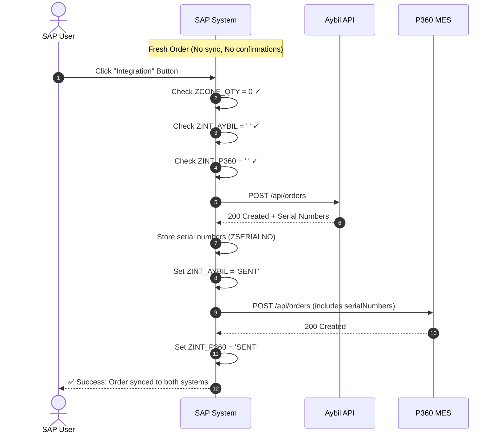
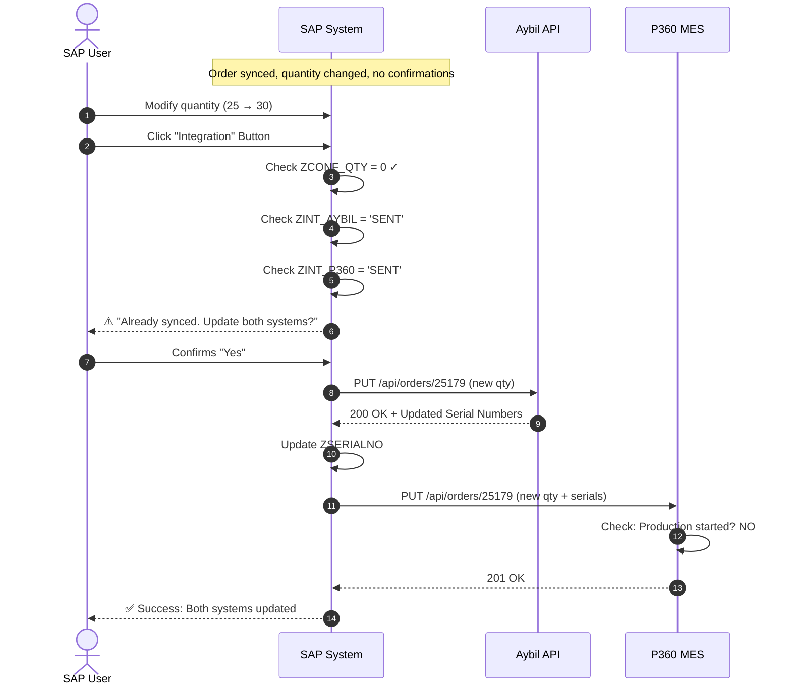
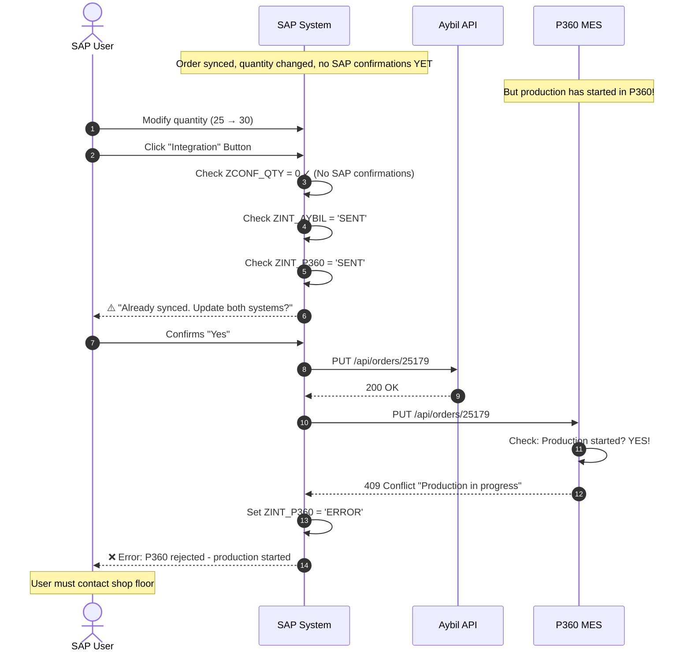
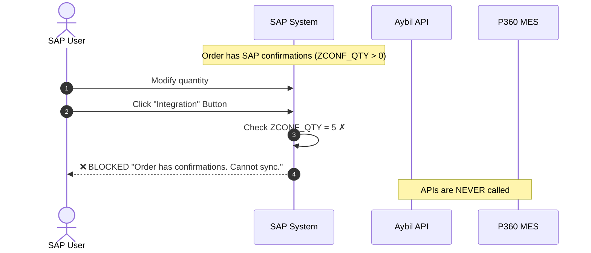

# Technical Design: SAP ↔ Aybil ↔ P360 Integration

**Interface ID:** `INT-PP-001`  
**Description:** Planned Order Synchronization with Serial Number Generation  
**Document Version:** 3.0 (Updated Feb 2026)

---

## 1. System Overview

### 1.1 System Roles

| System | Role | Sevirity | Key Function |
|:-------|:-----|:-----------:|:-------------|
| **SAP** | Source of Truth | - | Order management, triggers integrations |
| **Aybil** | Label Automation | 🔴 High | Generates serial numbers, prints barcodes on production line |
| **P360** | MES (Manufacturing Execution) | 🔴 High | Tracks production, manages shop floor execution |

### 1.2 Data Flow

```
┌─────────────────────────────────────────────────────────────────────────────┐
│                              INTEGRATION FLOW                               │
└─────────────────────────────────────────────────────────────────────────────┘

     ┌───────┐          ┌───────────┐          ┌───────────┐
     │  SAP  │          │   AYBIL   │          │   P360    │
     │       │   [1]    │           │   [2]    │           │
     │ Order ├─────────►│  Generate ├─────────►│   MES     │
     │ Data  │  Create  │  Serial   │  Create  │Production │
     │       │  Order   │  Numbers  │  Order   │  Tracking │
     └───────┘          └───────────┘          └───────────┘
         │                    │                      │
         │                    │                      │
         │              Serial Numbers          Production
         │              (Barcodes)               Status
         │                    │                      │
         │                    ▼                      ▼
         │              ┌───────────┐          ┌───────────┐
         │              │ Labels    │          │ Started?  │
         │              │ Printed   │          │ Confirmed?│
         └──────────────┴───────────┴──────────┴───────────┘
                              │
                              ▼
                    P360 Request needs Serial
                    Numbers from Aybil Response
```

### 1.3 Golden Rules

| # | Rule | Reason |
|:-:|:-----|:-------|
| 1 | Aybil MUST be called before P360 | P360 needs serial numbers from Aybil |
| 2 | If Aybil fails, P360 is NOT called | No serial numbers = can't create P360 order |
| 3 | P360 has production state checks | Once production starts, changes are not allowed from external resources |
| 4 | SAP confirmations = production happened | If SAP has confirmations, it means production started |

---

## 2. Status Tracking

### 2.1 SAP Status Fields

| Field | Description | Possible Values |
|:------|:------------|:----------------|
| `ZINT_AYBIL` | Aybil sync status | `' '`, `SENT`, `ERROR` |
| `ZINT_P360` | P360 sync status | `' '`, `SENT`, `ERROR` |
| `ZCONF_QTY` | Confirmed quantity | 0, 1, 2, ... n |
| `ZSERIALNO` | Serial numbers from Aybil | Array of strings |

### 2.2 Status Combinations & Meanings

| ZINT_AYBIL | ZINT_P360 | ZCONF_QTY | Meaning | What to Do? |
|:----------:|:---------:|:---------:|:--------|:------------------|
| `' '` | `' '` | 0 | Fresh order, never synced | ✅ Full access |
| `SENT` | `' '` | 0 | Aybil done, P360 pending | ✅ Can call P360 |
| `SENT` | `SENT` | 0 | Fully synced, not started | ⚠️ Update with warning |
| `SENT` | `SENT` | >0 | In production with confirmations | ❌ Blocked |
| `ERROR` | `' '` | 0 | Aybil failed | ✅ Retry Aybil |
| `SENT` | `ERROR` | 0 | P360 failed | ✅ Retry P360 |

---

## 3. Complete Decision Matrix


This is the main reference for ALL integration decisions:

| # | User Action | Aybil Status | P360 Status | SAP Confirmations | P360 Production State | Result | Message |
|:-:|:------------|:------------:|:-----------:|:-----------------:|:---------------------:|:------:|:--------|
| 1 | Create | `' '` | `' '` | None | N/A | ✅ | Proceed: Call Aybil → P360 |
| 2 | Create | `SENT` | `' '` | None | N/A | ✅ | Aybil exists, call P360 only |
| 3 | Create | `SENT` | `SENT` | None | Not Started | ⚠️ | "Already synced. Don't do anyhing - don't show in the list" |
| 4 | Create | `SENT` | `SENT` | None | Started | ❌ | WARNING IN SAP!!! - P360 returns error |
| 5 | Create | `SENT` | `SENT` | Exists | Any | ❌ | "Has confirmations - blocked" |
| 6 | Update (Qty) | `' '` | `' '` | None | N/A | ✅ | Proceed normally |
| 7 | Update (Qty) | `SENT` | `' '` | None | N/A | ✅ | Update Aybil → Call P360 |
| 8 | Update (Qty) | `SENT` | `SENT` | None | Not Started | ⚠️ | WARNING IN SAP!!! - Update Aybil → Update P360 |
| 9 | Update (Qty) | `SENT` | `SENT` | None | Started | ❌ | WARNING IN SAP!!! - P360 returns error |
| 10 | Update (Qty) | `SENT` | `SENT` | Exists | Any | ❌ | "Has confirmations - blocked" |
| 11 | Update (Date) | `SENT` | `SENT` | None | Not Started | ⚠️ |  Update Aybil → Update P360 |
| 12 | Update (Date) | `SENT` | `SENT` | None | Started | ❌ | P360 returns error |
| 13 | Update (Date) | `SENT` | `SENT` | Exists | Any | ❌ | "Has confirmations - blocked" |
| 14 | Delete | `' '` | `' '` | None | N/A | ✅ | Nothing to delete |
| 15 | Delete | `SENT` | `SENT` | None | Not Started | ⚠️ | "Delete from both" |
| 16 | Delete | `SENT` | `SENT` | None | Started | ❌ | P360 returns error |
| 17 | Delete | `SENT` | `SENT` | Exists | Any | ❌ |  "Has confirmations - blocked" |


## 4. Blocking Logic Flowchart

### 4.1 Pre-Flight Check (SAP Side)

```
┌─────────────────────────────────────────────────────────────────────────────┐
│                    USER CLICKS "INTEGRATION" BUTTON                         │
└─────────────────────────────────────────────────────────────────────────────┘
                                      │
                                      ▼
                         ┌────────────────────────┐
                         │  ZCONF_QTY > 0 ?       │
                         │  (Has Confirmations?)  │
                         └────────────────────────┘
                                │           │
                               YES          NO
                                │           │
                                ▼           ▼
                         ┌─────────────┐   ┌────────────────────────┐
                         │ ❌ BLOCKED  │   │  Both AYBIL & P360     │
                         │             │   │  already SENT?         │
                         │ "Order has  │   └────────────────────────┘
                         │ confirmations│         │           │
                         │ Cannot sync" │        YES          NO
                         └─────────────┘         │           │
                                                 ▼           │
                                   ┌─────────────────┐       │
                                   │ ⚠️ WARNING      │       │
                                   │                 │       │
                                   │ "Already synced.│       │
                                   │  Continue?"     │       │
                                   └─────────────────┘       │
                                          │                  │
                                    User Confirms            │
                                          │                  │
                                          ▼                  ▼
                              ┌─────────────────────────────────┐
                              │      PROCEED TO API CALLS       │
                              └─────────────────────────────────┘
                                              │
                                              ▼
                                     [See Section 4.2]
```

### 4.2 API Call Flow with P360 Production Check

```
┌─────────────────────────────────────────────────────────────────────────────┐
│                         API CALL FLOW                                        │
└─────────────────────────────────────────────────────────────────────────────┘
                                      │
                                      ▼
                         ┌────────────────────────┐
                         │  ZINT_AYBIL = SENT?    │
                         │  (Aybil already done?) │
                         └────────────────────────┘
                                │           │
                               YES          NO
                                │           │
                                │           ▼
                                │    ┌─────────────────┐
                                │    │ Call Aybil API  │
                                │    │ POST /orders    │
                                │    └─────────────────┘
                                │           │
                                │           ▼
                                │    ┌─────────────────┐
                                │    │ Aybil Success?  │
                                │    └─────────────────┘
                                │      │          │
                                │     YES         NO
                                │      │          │
                                │      │          ▼
                                │      │   ┌─────────────┐
                                │      │   │ ❌ STOP     │
                                │      │   │ Log Error   │
                                │      │   │ Show Error  │
                                │      │   └─────────────┘
                                │      │
                                ▼      ▼
                         ┌────────────────────────┐
                         │  Store Serial Numbers  │
                         │  from Aybil Response   │
                         └────────────────────────┘
                                      │
                                      ▼
                         ┌────────────────────────┐
                         │  ZINT_P360 = SENT?     │
                         │  (P360 already done?)  │
                         └────────────────────────┘
                                │           │
                               YES          NO
                                │           │
                                ▼           │
                   ┌────────────────────┐   │
                   │ This is an UPDATE  │   │
                   │ Call P360 PUT      │   │
                   │ with updated data  │   │
                   └────────────────────┘   │
                                │           │
                                ▼           ▼
                         ┌────────────────────────┐
                         │    Call P360 API       │
                         │    (POST or PUT)       │
                         └────────────────────────┘
                                      │
                                      ▼
                         ┌────────────────────────┐
                         │   P360 Response?       │
                         └────────────────────────┘
                           │        │        │
                         200      400      409/423
                           │        │        │
                           ▼        ▼        ▼
                      ┌────────┐ ┌─────┐ ┌──────────────────┐
                      │   ✅   │ │ ❌  │ │ ❌ PRODUCTION    │
                      │SUCCESS │ │ERROR│ │    STARTED       │
                      │        │ │     │ │                  │
                      │Set both│ │Log &│ │"Changes blocked: │
                      │ SENT   │ │Show │ │ Order in prod."  │
                      └────────┘ └─────┘ └──────────────────┘
```

---

## 5. P360 Production State Handling

### 5.1 P360 Must Check Production State

The P360 API should implement this logic on their side:

```
┌─────────────────────────────────────────────────────────────────────────────┐
│                    P360 RECEIVES REQUEST (PUT /orders/{id})                  │
└─────────────────────────────────────────────────────────────────────────────┘
                                      │
                                      ▼
                         ┌────────────────────────┐
                         │  Find order by         │
                         │  externalId            │
                         └────────────────────────┘
                                      │
                          ┌───────────┴───────────┐
                          │                       │
                       Found                  Not Found
                          │                       │
                          ▼                       ▼
              ┌─────────────────────┐    ┌─────────────────┐
              │ Check production    │    │ Create new      │
              │ state               │    │ (Upsert logic)  │
              └─────────────────────┘    │ Return 201      │
                          │              └─────────────────┘
                          ▼
              ┌─────────────────────┐
              │ productionStarted?  │
              └─────────────────────┘
                    │           │
                   YES          NO
                    │           │
              ┌─────┴           ▼
              │            ┌─────────────────┐
              │            │ ✅ Allow update │
              │            │ Return 200      │
              │            └─────────────────┘
              ▼
    ┌─────────────────────────┐
    │ ❌ REJECT               │
    │                         │
    │ Return 409/423          │
    │ "Production in progress.│
    │  Changes not allowed."  │
    └─────────────────────────┘
```

### 5.2 P360 Error Response for Production State

When P360 blocks a change due to production state:

```json
{
  "status": "Error",
  "errorCode": "PROD_IN_PROGRESS",
  "httpStatus": 409,
  "timestamp": "2026-02-05T16:00:00Z",
  "message": "Order cannot be modified - production has started",
  "details": {
    "externalId": "25179",
    "productionState": "IN_PROGRESS",
    "startedAt": "2026-02-05T10:00:00Z",
    "startedQuantity": 5,
    "totalQuantity": 25
  }
}
```

### 5.3 Recommended P360 HTTP Status Codes

| Scenario | HTTP Code | Meaning |
|:---------|:---------:|:--------|
| Success - Created | `200` | New order created |
| Success - Updated | `201` | Existing order updated |
| Error - Validation | `400` | Bad data (qty ≤ 0, etc.) |
| Error - Not Found | `404` | Order ID not found (for PUT/DELETE) |
| Error - Production Started | `409` | Conflict - production in progress |
| Error - Locked | `423` | Locked - cannot modify |
| Error - Server | `500` | Internal error |

---

## 6. Sequence Diagrams

### 6.1 Scenario: Fresh Order - Full Create Flow



### 6.2 Scenario: Update When Both Already Synced (No Production)



### 6.3 Scenario: Update Blocked - Production Started in P360



### 6.4 Scenario: Blocked at SAP Level - Has Confirmations



---

## 7. API Specifications

### 7.1 Aybil API

**Base URL:** `http://10.141.0.95:8000`

| Action | Method | Endpoint | Status | Description |
|:-------|:------:|:---------|:------------|:------------|
| Create | POST | `/EzzySAPWebApi/Integration/UpdateWorkOrder/` |1| Create order, generate serial numbers |
| Update | POST | `/EzzySAPWebApi/Integration/UpdateWorkOrder/` |2| Update order, regenerate serials if qty changed |
| Delete | POST | `/EzzySAPWebApi/Integration/UpdateWorkOrder/` |3| Cancel order, soft-delet order but keep the related serial no |

**Aybil Request Body:**
```json
{

 "WorkOrderNo":"960517-0",
 "ProductCode":"7072202067",
 "Description":"8K LG ZMNW07GJRW1 LG EUROPE SJ",
 "LineCode":"DIS_1",
 "PlannedQuantity":"5",
 "PlannedDate":"2025-12-15 15:39:05.000",
 "Status": 2
}
```


**Aybil Response (Success):**
```json
{
  "WorkOrderNo": "960517-0",
  "ProductCode": "7072202067",
  "Description": "8K LG ZMNW07GJRW1 LG EUROPE SJ",
  "LineCode": "DIS_1",
  "PlannedQuantity": 5,
  "PlannedDate": "2025-12-15 15:39:05.000",
  "Controller": "Integration",
  "Action": "UpdateWorkOrder - Update",
  "Result": 0,
  "UserName": "aybil",
  "Message": "Success",
  "Details": [
    {
      "DomesticCode": "7072202067250023881201",
      "SerialCode": "512TKQE02388"
    },
    {
      "DomesticCode": "7072202067250023891201",
      "SerialCode": "512TKZQ02389"
    },
    {
      "DomesticCode": "7072202067250023901201",
      "SerialCode": "512TKSV02390"
    },
    {
      "DomesticCode": "7072202067250023911201",
      "SerialCode": "512TKGX02391"
    },
    {
      "DomesticCode": "7072202067250023921201",
      "SerialCode": "512TKLP02392"
    }
  ]
}
```

### 7.2 P360 API

**Base URL:** `https://api.p360.com/v1`

| Action | Method | Endpoint | Description |
|:-------|:------:|:---------|:------------|
| Create | POST | `/orders` | Create order with serial numbers |
| Update | PUT | `/orders/{externalId}` | Update order (if production not started) |
| Delete | DELETE | `/orders/{externalId}` | Cancel order (if production not started) |
| Check Status | GET | `/orders/{externalId}/status` | Get production state |

**P360 Request Body (includes serials from Aybil):**
```json
{
  "externalId": "25179",
  "plannedStartDate": "2026-01-14T14:30:00Z",
  "plannedEndDate": "2026-01-14T15:30:00Z",
  "materialCode": "1122334455",
  "materialName": "12 DEMODENEME123 V1 EUROPE",
  "brand": "MARKA",
  "modelGroup": "IC",
  "chassisCode": "U4_4HP",
  "isWifi": "false",
  "quantity": 25,
  "description": "SAP üzerinden gelen iş emri",
  "serialNumbers": [
    "SN-25179-001",
    "SN-25179-002",
    "SN-25179-003"
  ],
  "assetName": "MIX_BANT",
  "bom": {
    "bomMaterials": [{
       "materialCode": "1234567890",           
       "materialName": "Malzeme",              
       "quantity": 1,                          
       "isCritical": "FM",                     
       "criticalDescription": "Fan Motor",     
       "materialUnitCode": "ST"                
      },...
    ]
  }
}
```

**P360 Response (Success):**
```json
{
  "status": "Success",
  "externalId": "25179",
  "p360Id": "P360-2026-00456",
  "productionState": "NOT_STARTED",
  "timestamp": "2026-02-05T16:00:00Z"
}
```

**P360 Response (Blocked - Production Started):**
```json
{
  "status": "Error",
  "errorCode": "PROD_IN_PROGRESS",
  "externalId": "25179",
  "productionState": "IN_PROGRESS",
  "message": "Cannot modify - production has started",
  "completedQuantity": 5,
  "timestamp": "2026-02-05T16:00:00Z"
}
```

---

## 8. Quick Reference Tables

### 8.1 SAP Developer: When to Block/Warn/Proceed

| Check Order | Condition | Action |
|:------------|:----------|:------:|
| 1st | `ZCONF_QTY > 0` | ❌ Block |
| 2nd | `ZINT_AYBIL = 'SENT' AND ZINT_P360 = 'SENT'` | ⚠️ Warn |
| 3rd | `ZINT_AYBIL = 'SENT' AND ZINT_P360 = ' '` | ✅ Proceed (P360 only) |
| 4th | `ZINT_AYBIL = ' '` | ✅ Proceed (Full flow) |

### 8.2 P360 Developer: When to Accept/Reject Updates

| Condition | Accept? | Response |
|:----------|:-------:|:---------|
| Order not found | ✅ | Create it (upsert) - 201 |
| Order found, not started | ✅ | Update it - 200 |
| Order found, started, only line change | ⚠️ | Update with warning - 200 |
| Order found, started, qty/date changed | ❌ | Reject - 409 |
| Order found, completed | ❌ | Reject - 423 |

### 8.3 Complete State × Action Matrix

```
                    ┌─────────────────────────────────────────────────────────┐
                    │                    P360 PRODUCTION STATE                 │
                    ├─────────────┬─────────────┬─────────────┬───────────────┤
                    │ NOT_STARTED │ IN_PROGRESS │  COMPLETED  │   CANCELLED   │
┌───────────────────┼─────────────┼─────────────┼─────────────┼───────────────┤
│                   │             │             │             │               │
│ SAP: No Confirm   │     ✅      │     ❌*    │     ❌      │      ✅      │
│ SAP: Has Confirm  │     ❌      │     ❌     │     ✅      │      ❌      │
│                   │             │             │             │               │
└───────────────────┴─────────────┴─────────────┴─────────────┴───────────────┘

✅ = Allowed
❌ = Blocked
❌* = Blocked by P360 (SAP allows but P360 rejects)
```

---

## 9. Error Messages Reference

### 9.1 SAP UI Messages

| Code | Type | Message (EN) | Message (TR) |
|:-----|:----:|:-------------|:-------------|
| E001 | ❌ | Order has confirmations. Cannot sync. | Siparişte teyit var. Entegrasyon yapılamaz. |
| E002 | ❌ | Order is closed. Cannot sync. | Sipariş kapalı. Entegrasyon yapılamaz. |
| E003 | ❌ | Order number is required. | Sipariş numarası gerekli. |
| W001 | ⚠️ | Already synced. Continue with update? | Zaten gönderilmiş. Güncellensin mi? |
| W002 | ⚠️ | No changes detected. Dont list it? | Değişiklik yok. Listede gösterme? |
| S001 | ✅ | Successfully synced to both systems. | Her iki sisteme başarıyla gönderildi. |
| S002 | ⚠️ | Aybil OK, but P360 failed. | Aybil başarılı, P360 başarısız. |

### 9.2 API Error Codes

| Source | Code | HTTP | Description |
|:-------|:-----|:----:|:------------|
| Aybil | AYB_001 | 400 | Invalid quantity |
| Aybil | AYB_002 | 400 | Missing required field |
| Aybil | AYB_003 | 500 | Serial generation failed |
| P360 | P360_001 | 400 | Invalid data |
| P360 | P360_002 | 404 | Order not found |
| P360 | P360_003 | 409 | Production in progress |
| P360 | P360_004 | 423 | Order locked/completed |

---

## 10. Appendix

### 10.1 Document History

| Version | Date | Author | Changes |
|:--------|:-----|:-------|:--------|
| 1.0 | Jan 2026 | - | Initial draft |
| 2.0 | Feb 2026 | - | Added P360 integration |
| 3.0 | Feb 2026 | - | Added production state checks, blocking logic |

---

**Document Owner:** GD  
**Last Updated:** February 2026  
**Next Review:** March 2026
